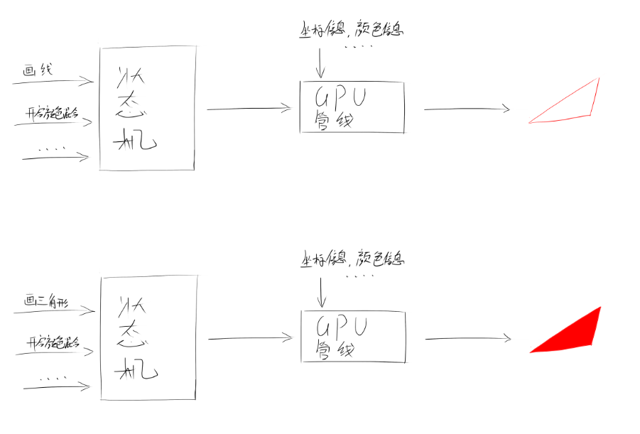

# OpenGL的Application创建

## 准备工作

在进行application类的设计前，先要知道以下glfw3.h的语法:

### 基本环境配置

```cpp
//1 初始化GLFW基本环境
glfwInit();
//1.1 设置OpenGL主版本号、次版本号
glfwWindowHint(GLFW_CONTEXT_VERSION_MAJOR, 4);
glfwWindowHint(GLFW_CONTEXT_VERSION_MINOR, 6);
//1.2 设置OpenGL启用核心模式（非立即渲染模式）
glfwWindowHint(GLFW_OPENGL_PROFILE, GLFW_OPENGL_CORE_PROFILE);
```

所谓的主版本号、次版本号，不过就是设置使用OpenGL x.x版本的意思，

如上述语句，使用的就是 OpenGL 4.6 版本。

将OpenGL设定为核心模式，即为自定   ||状态机||   模式，这个时候   ||GPU管线||   的各种参数需要自己手动设定，这种模式虽然不便于理解，但是绘制的效率远比  立即渲染模式  效率要高的多的多。

那么什么是状态机和GPU管线呢？

#### 状态机

去对状态开启或者关闭，OpenGl就会对这些状态参数进行进行调配，去执行操作，

比如往传入了三个坐标，将绘制的状态设置为“画线”那么结果就会绘制三点个连接起来的线组成的三角形

再将绘制状态设置为“画三角形”那么结果就会绘制一个完整的三角形，如图所示：

状态机还有很多状态可以开启关闭，通过不同的状态组合能够绘制出不同的结果。


#### GPU管线

gpu往往有着强大的计算能力，但是即便如因此，如果让gpu一步一步的来渲染那效率是及其低下的，

因此GPU引入了自己的“流水线”---------管线，来进一步提高渲染的效率。


流程一般为：


将数据存入显存中--->顶点着色---->计算剪裁---->图元装配---->光栅化----->片段着色


顶点着色： 对每个坐标进行加工操作，如进行透视变换，模型变换等。

计算剪裁：将超出范围的顶点进行添加删去的操作。
